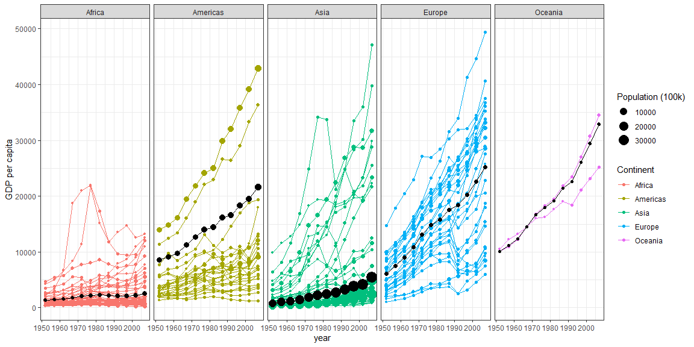

## Background


## Image


```r
weight <- gapminder %>% 
  group_by(continent, year) %>% 
  mutate(w.mean=weighted.mean(x=gdpPercap, w=pop))

gapminder %>%
 filter(country != "Kuwait") %>% 
ggplot(aes(x=year, y=gdpPercap)) + 
  geom_line(aes(group=country, color=continent)) +
  geom_point(aes(color=continent, size=pop/40000)) +
  geom_point(data=weight, aes(x=year, y=w.mean, size=pop/40000), color="black") +
  geom_line(data=weight, aes(x=year, y=w.mean), color="black") +
  facet_wrap(~ continent, nrow=1) +
  theme_bw() +
  labs(X = "Year", y="GDP per capita", color="Continent", size="Population (100k)")
```

<!-- -->


```r
ggsave("image.png", width = 15, units = "in")
```
