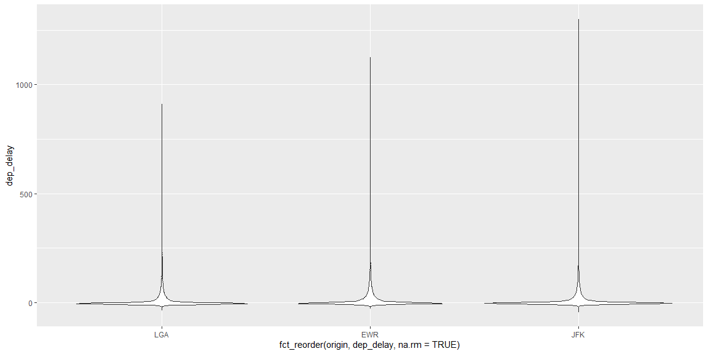
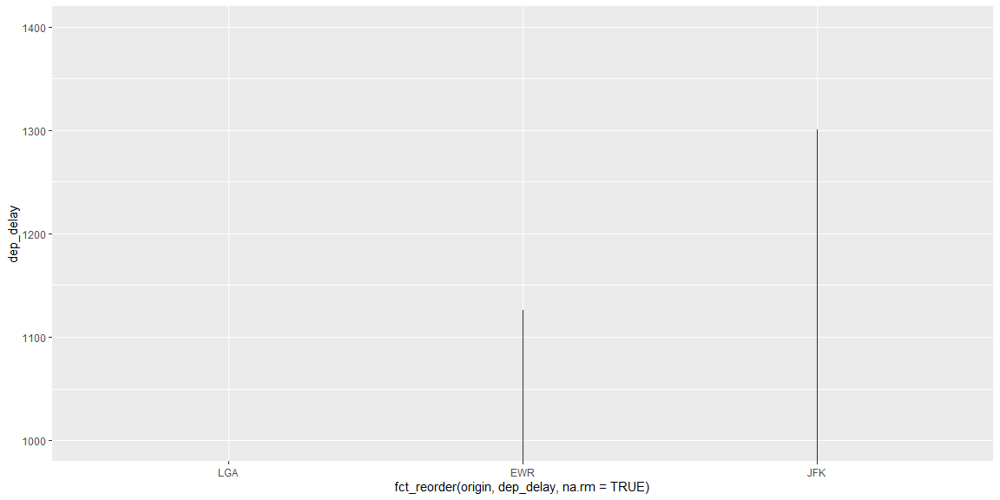

```r
# Use this R-Chunk to import all your datasets!
glimpse(flights)
```

```
## Rows: 336,776
## Columns: 19
## $ year           <int> 2013, 2013, 2013, 2013, 2013, 2013, 2013, 2013, 2013, 2~
## $ month          <int> 1, 1, 1, 1, 1, 1, 1, 1, 1, 1, 1, 1, 1, 1, 1, 1, 1, 1, 1~
## $ day            <int> 1, 1, 1, 1, 1, 1, 1, 1, 1, 1, 1, 1, 1, 1, 1, 1, 1, 1, 1~
## $ dep_time       <int> 517, 533, 542, 544, 554, 554, 555, 557, 557, 558, 558, ~
## $ sched_dep_time <int> 515, 529, 540, 545, 600, 558, 600, 600, 600, 600, 600, ~
## $ dep_delay      <dbl> 2, 4, 2, -1, -6, -4, -5, -3, -3, -2, -2, -2, -2, -2, -1~
## $ arr_time       <int> 830, 850, 923, 1004, 812, 740, 913, 709, 838, 753, 849,~
## $ sched_arr_time <int> 819, 830, 850, 1022, 837, 728, 854, 723, 846, 745, 851,~
## $ arr_delay      <dbl> 11, 20, 33, -18, -25, 12, 19, -14, -8, 8, -2, -3, 7, -1~
## $ carrier        <chr> "UA", "UA", "AA", "B6", "DL", "UA", "B6", "EV", "B6", "~
## $ flight         <int> 1545, 1714, 1141, 725, 461, 1696, 507, 5708, 79, 301, 4~
## $ tailnum        <chr> "N14228", "N24211", "N619AA", "N804JB", "N668DN", "N394~
## $ origin         <chr> "EWR", "LGA", "JFK", "JFK", "LGA", "EWR", "EWR", "LGA",~
## $ dest           <chr> "IAH", "IAH", "MIA", "BQN", "ATL", "ORD", "FLL", "IAD",~
## $ air_time       <dbl> 227, 227, 160, 183, 116, 150, 158, 53, 140, 138, 149, 1~
## $ distance       <dbl> 1400, 1416, 1089, 1576, 762, 719, 1065, 229, 944, 733, ~
## $ hour           <dbl> 5, 5, 5, 5, 6, 5, 6, 6, 6, 6, 6, 6, 6, 6, 6, 5, 6, 6, 6~
## $ minute         <dbl> 15, 29, 40, 45, 0, 58, 0, 0, 0, 0, 0, 0, 0, 0, 0, 59, 0~
## $ time_hour      <dttm> 2013-01-01 05:00:00, 2013-01-01 05:00:00, 2013-01-01 0~
```

```r
fl <- flights
```

## Background

efore we can start to answer business questions we need to become familiar with our data. Often, you will want to start with the data dictionary (What is a Data Dictionary? (Links to an external site.)). However, you can also just dive into the data and gain an understanding based on the variable names and types.

Beyond the variable descriptions is how the variables relate to each other. We can create tables or visualizations that summarize how different variables relate to each other. At this point, we are deepening our understanding as well as beginning our analysis.

Remember: Your job is to become the data expert, not the domain expert.  You will build domain skills but you are not going to replace domain experts. People will depend on you to have a firm understanding of what data your company has available to answer domain-specific questions.

Use nycflights13::flights  to practice your data summary and data investigation through visualization skills.

## Data Wrangling


```r
# Use this R-Chunk to clean & wrangle your data!
```

## Data Visualization


```r
ggplot(data = flights,
       aes(x = fct_reorder(origin, dep_delay, na.rm = TRUE),
           y = dep_delay)) +
  geom_violin()
```

<!-- -->

```r
ggsave("image1.png", width = 15, units = "in")
ggplot(data = flights,
       aes(x = fct_reorder(origin, dep_delay, na.rm = TRUE),
           y = dep_delay)) +
  geom_violin() +
  coord_cartesian(ylim = c(1000, 1400))
```

<!-- -->

```r
ggsave("image2.png", width = 15, units = "in")
```

## Conclusions
