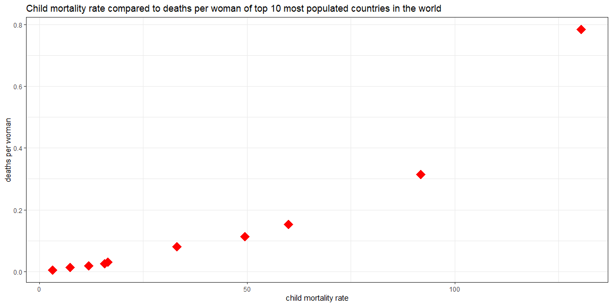

```r
# Use this R-Chunk to import all your datasets!
child_mortality_rate <- ourworldindata::child_mortality
child_mortality_rate2 <- filter(child_mortality_rate, year == "2010" )
```

## Background

_Place Task Background Here_

## Data Wrangling


```r
child_mortality_rate3 <- filter(child_mortality_rate2, population >= 126535920) 
```


```r
child_mortality_rate3 %>% 
  arrange(country)
```

```
## # A tibble: 10 x 10
##     year country       continent population child_mort survival_per_woman
##    <int> <chr>         <chr>          <int>      <dbl>              <dbl>
##  1  2010 Bangladesh    Asia       148692131       49.5               2.16
##  2  2010 Brazil        Americas   194946470       16.6               1.81
##  3  2010 China         Asia      1341335152       15.7               1.62
##  4  2010 India         Asia      1224614327       60.0               2.41
##  5  2010 Indonesia     Asia       239870937       33.1               2.35
##  6  2010 Japan         Asia       126535920        3.2               1.37
##  7  2010 Nigeria       Africa     158423182      130.                5.24
##  8  2010 Pakistan      Asia       173593383       91.8               3.12
##  9  2010 Russia        Europe     142958164       12.0               1.55
## 10  2010 United States Americas   310383948        7.4               1.91
## # ... with 4 more variables: deaths_per_woman <dbl>, poverty <dbl>,
## #   education <dbl>, health_exp <dbl>
```


```r
child_mortality_rate3 %>% 
  summarise(aveMortlaity = mean(child_mort))
```

```
## # A tibble: 1 x 1
##   aveMortlaity
##          <dbl>
## 1         42.0
```

## Data Visualization


```r
# Use this R-Chunk to plot & visualize your data!
ggplot(child_mortality_rate3, aes(x=child_mort, y=deaths_per_woman)) +
  geom_point(size = 6, color = "red", pch = 18) +
  labs(title="Child mortality rate compared to deaths per woman of top 10 most populated countries in the world", 
       x = "child mortality rate", y="deaths per woman") +
  theme_bw()
```

<!-- -->

## Conclusions
"The visual above shows average child mortality rate of top 10 countries in the world on the basis of population for every 50 years."
