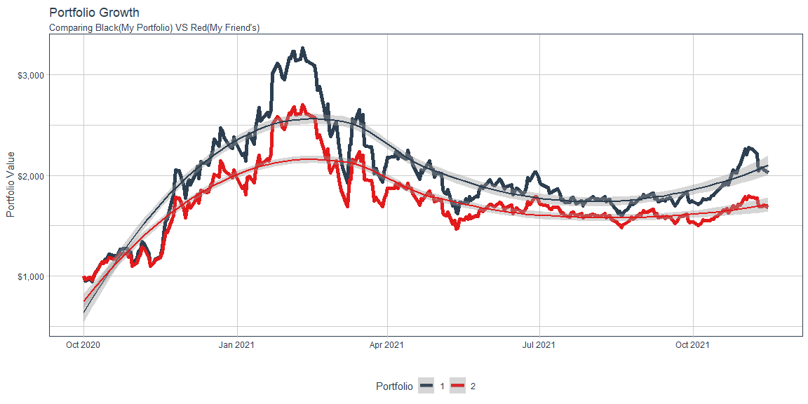
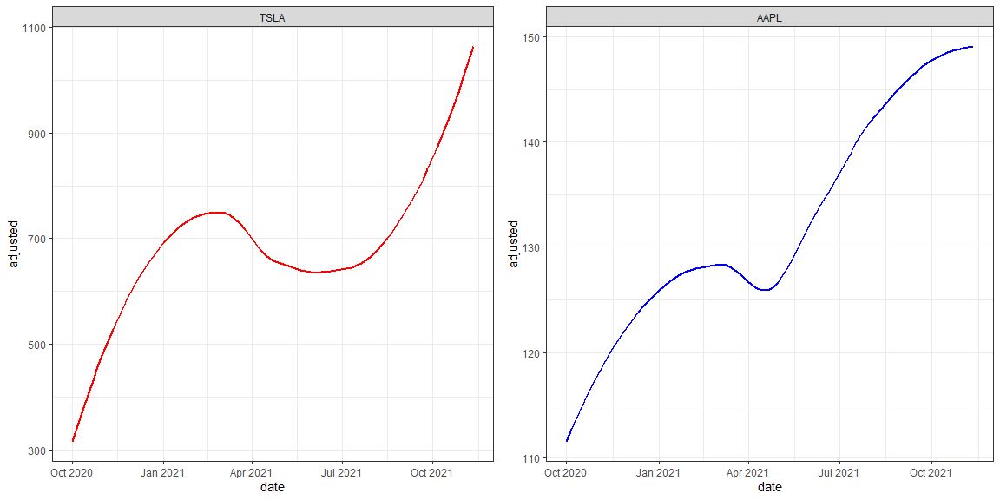

```r
# Use this R-Chunk to import all your datasets!

stock_returns_monthly <- c("TSLA", "JMIA", "AAPL") %>%
    tq_get(get  = "stock.prices",
           from = "2020-10-01",
           to   = "2021-11-16") %>%
    group_by(symbol) %>%
    tq_transmute(select     = adjusted, 
                 mutate_fun = periodReturn, 
                 period     = "daily", 
                 col_rename = "Ra")

baseline_returns_monthly <- "XLK" %>%
    tq_get(get  = "stock.prices",
           from = "2020-10-01",
           to   = "2021-11-16") %>%
    tq_transmute(select     = adjusted, 
                 mutate_fun = periodReturn, 
                 period     = "monthly", 
                 col_rename = "Rb")

TSLA <- tq_get("TSLA", get = "stock.prices", from = "2020-10-01", to = "2021-11-12") %>%
  select(symbol, date, adjusted)
end <- as_date("2021-11-12")

AAPL <- tq_get("AAPL", get = "stock.prices", from = "2020-10-01", to = "2021-11-12") %>%
  select(symbol, date, adjusted)
end <- as_date("2021-11-12")
```

## Background

The stock market is overflowing with data. There are many packages in R that allow us to get quick access to information on publicly traded companies. Imagine that you and a friend each purchased about $1,000 of stock in three different stocks at the start of October last year, and you want to compare your performance up to this week. Use the stock shares purchased and share prices to demonstrate how each of you fared over the period you were competing (assuming that you did not change your allocations).

## Data Wrangling


```r
# Use this R-Chunk to clean & wrangle your data!

stock_returns_monthly_multi <- stock_returns_monthly %>%
    tq_repeat_df(n = 2)
stock_returns_monthly_multi
```

```
## # A tibble: 1,704 x 4
## # Groups:   portfolio [2]
##    portfolio symbol date             Ra
##        <int> <chr>  <date>        <dbl>
##  1         1 TSLA   2020-10-01  0      
##  2         1 TSLA   2020-10-02 -0.0738 
##  3         1 TSLA   2020-10-05  0.0255 
##  4         1 TSLA   2020-10-06 -0.0275 
##  5         1 TSLA   2020-10-07  0.0273 
##  6         1 TSLA   2020-10-08  0.00146
##  7         1 TSLA   2020-10-09  0.0190 
##  8         1 TSLA   2020-10-12  0.0191 
##  9         1 TSLA   2020-10-13  0.00983
## 10         1 TSLA   2020-10-14  0.0328 
## # ... with 1,694 more rows
```

```r
weights <- c(
    0.50, 0.25, 0.25,
    0.20, 0.20, 0.60
)
stocks <- c("TSLA", "JMIA", "AAPL")
weights_table <-  tibble(stocks) %>%
    tq_repeat_df(n = 2) %>%
    bind_cols(tibble(weights)) %>%
    group_by(portfolio)
weights_table
```

```
## # A tibble: 6 x 3
## # Groups:   portfolio [2]
##   portfolio stocks weights
##       <int> <chr>    <dbl>
## 1         1 TSLA      0.5 
## 2         1 JMIA      0.25
## 3         1 AAPL      0.25
## 4         2 TSLA      0.2 
## 5         2 JMIA      0.2 
## 6         2 AAPL      0.6
```


```r
portfolio_returns_monthly_multi <- stock_returns_monthly_multi %>%
    tq_portfolio(assets_col  = symbol, 
                 returns_col = Ra, 
                 weights     = weights_table, 
                 col_rename  = "Ra")
portfolio_returns_monthly_multi
```

```
## # A tibble: 568 x 3
## # Groups:   portfolio [2]
##    portfolio date              Ra
##        <int> <date>         <dbl>
##  1         1 2020-10-01  0       
##  2         1 2020-10-02 -0.0450  
##  3         1 2020-10-05  0.0221  
##  4         1 2020-10-06 -0.0277  
##  5         1 2020-10-07  0.0375  
##  6         1 2020-10-08  0.0630  
##  7         1 2020-10-09  0.00797 
##  8         1 2020-10-12  0.0796  
##  9         1 2020-10-13  0.000775
## 10         1 2020-10-14  0.0283  
## # ... with 558 more rows
```

```r
RaRb_multiple_portfolio <- left_join(portfolio_returns_monthly_multi, 
                                     baseline_returns_monthly,
                                     by = "date")
RaRb_multiple_portfolio
```

```
## # A tibble: 568 x 4
## # Groups:   portfolio [2]
##    portfolio date              Ra    Rb
##        <int> <date>         <dbl> <dbl>
##  1         1 2020-10-01  0           NA
##  2         1 2020-10-02 -0.0450      NA
##  3         1 2020-10-05  0.0221      NA
##  4         1 2020-10-06 -0.0277      NA
##  5         1 2020-10-07  0.0375      NA
##  6         1 2020-10-08  0.0630      NA
##  7         1 2020-10-09  0.00797     NA
##  8         1 2020-10-12  0.0796      NA
##  9         1 2020-10-13  0.000775    NA
## 10         1 2020-10-14  0.0283      NA
## # ... with 558 more rows
```

```r
RaRb_multiple_portfolio %>%
    tq_performance(Ra = Ra, Rb = Rb, performance_fun = table.CAPM)
```

```
## # A tibble: 2 x 13
## # Groups:   portfolio [2]
##   portfolio ActivePremium   Alpha AnnualizedAlpha   Beta `Beta-` `Beta+`
##       <int>         <dbl>   <dbl>           <dbl>  <dbl>   <dbl>   <dbl>
## 1         1         -615. -0.0162          -0.984 0.0164   0.634  -0.523
## 2         2         -615. -0.0167          -0.986 0.0103   0.614  -0.454
## # ... with 6 more variables: Correlation <dbl>, Correlationp-value <dbl>,
## #   InformationRatio <dbl>, R-squared <dbl>, TrackingError <dbl>,
## #   TreynorRatio <dbl>
```

```r
RaRb_multiple_portfolio %>%
    tq_performance(Ra = Ra, Rb = NULL, performance_fun = SharpeRatio)
```

```
## # A tibble: 2 x 4
## # Groups:   portfolio [2]
##   portfolio `ESSharpe(Rf=0%,p=95%)` `StdDevSharpe(Rf=0%,p=95%)` `VaRSharpe(Rf=0~
##       <int>                   <dbl>                       <dbl>            <dbl>
## 1         1                  0.0519                      0.0816           0.0618
## 2         2                  0.0432                      0.0704           0.0521
```


```r
p1 <- TSLA %>%
ggplot(aes(x = date, y = adjusted, color = symbol)) +
  geom_smooth(method = loess, formula = y ~ x, se = FALSE) +
  facet_wrap(~ symbol) +
  scale_color_manual(values = c("red")) + 
  theme_bw() +
  theme(legend.position = "none")
p2 <- AAPL %>%
ggplot(aes(x = date, y = adjusted, color = symbol)) +
  geom_smooth(method = loess, formula = y ~ x, se = FALSE) +
  facet_wrap(~ symbol) +
  scale_color_manual(values = c("blue")) + 
  theme_bw() +
  theme(legend.position = "none")
```

## Data Visualization
1. 50% TSLA, 25% JMIA, 25% AAPL
2. 20% TSLA, 20% JMIA, 60% AAPL


```r
portfolio_growth_monthly_multi <- stock_returns_monthly_multi %>%
    tq_portfolio(assets_col   = symbol, 
                 returns_col  = Ra, 
                 weights      = weights_table,
                 col_rename   = "investment.growth",
                 wealth.index = TRUE) %>%
    mutate(investment.growth = investment.growth * 1000)
```


```r
portfolio_growth_monthly_multi %>%
    ggplot(aes(x = date, y = investment.growth, color = factor(portfolio))) +
    geom_line(size = 2) +
    labs(title = "Portfolio Growth",
         subtitle = "Comparing Black(My Portfolio) VS Red(My Friend's)",
         x = "", y = "Portfolio Value",
         color = "Portfolio") +
    geom_smooth(method = "loess", formula = "y ~ x") +
    theme_tq() +
    scale_color_tq() +
    scale_y_continuous(labels = scales::dollar)
```

<!-- -->

```r
grid.arrange(p1, p2, ncol = 2, nrow = 1)
```

<!-- -->

## Conclusions

In the graph we can clearly see that My portfolio made better returns than my friend's. I invested most of my money on TSLA stocks and at the end I ended up making slight more profit than Her portfolio which consists of more than 50% of AAPL stocks and less of TSLA. At the end TSLA turned out to be the stock that decided who made better profit and helped me win the competition. I have attached the comparision of AAPL(which went up by about 50% in that duration) and TSLA(which went up by more than 150% in that duration) stocks to show how TSLA made better profits.
