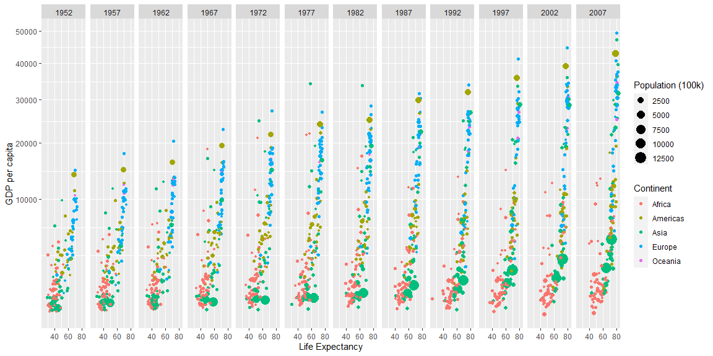

## Background

Things learned while making the plot:
Europe has the highest GDP and life Expectancy and Lowest GDP per capita and Life Expectancy is of Africa.
Americas come second to Europe and majority of population is Asia lie under the bottom half of the plot

## Image


```r
gapminder %>%
 filter(country != "Kuwait") %>%
ggplot(mapping = aes(x=lifeExp, y=gdpPercap)) + 
  geom_point(mapping = aes(x=lifeExp, y=gdpPercap, color=continent, size=pop/100000)) +
  facet_wrap(~ year, nrow=1) + 
  scale_y_continuous(trans = "sqrt") + 
  labs(x = "Life Expectancy", y="GDP per capita",color = "Continent", size = "Population (100k)")
```

<!-- -->


```r
ggsave("image1.png", width = 15, units = "in")
```
