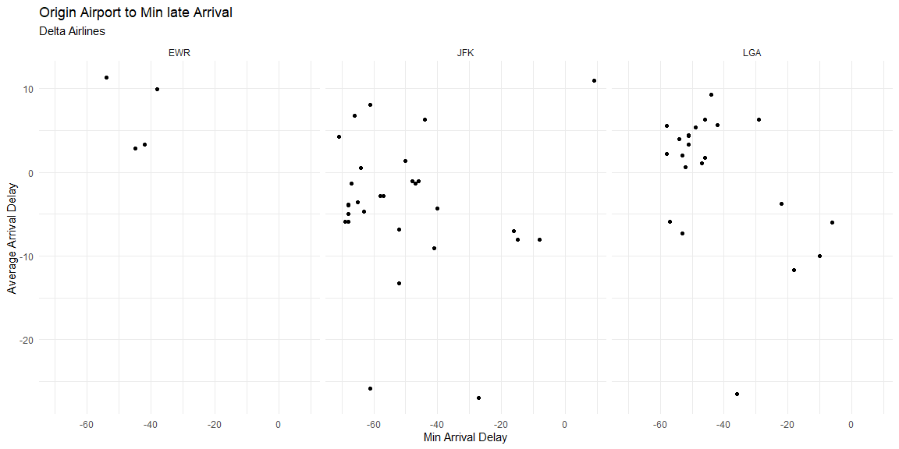
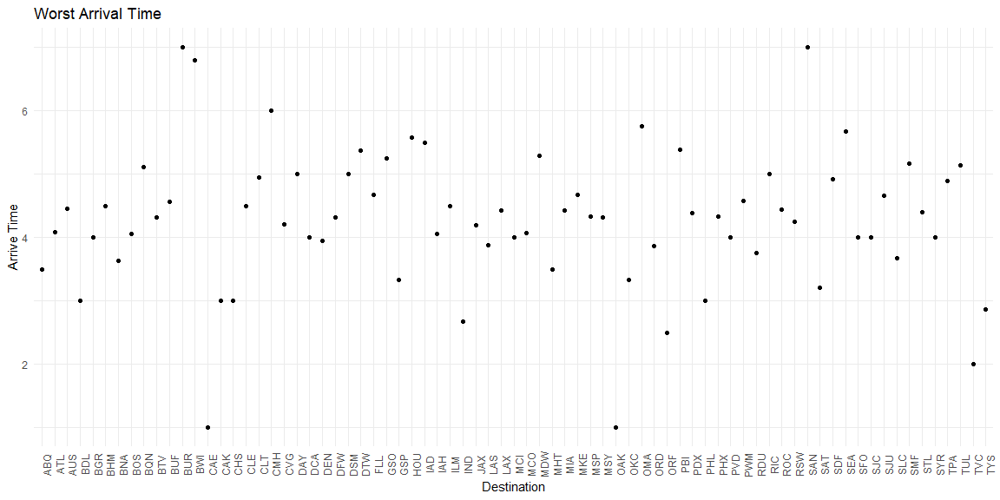

```r
# Use this R-Chunk to import all your datasets!
flights <- nycflights13::flights
flights <- na.omit(flights)
```

## Background

You just started your internship at a big firm in New York, and your manager gave you an extensive file of flights that departed JFK, LGA, or EWR in 2013. From this data (nycflights13::flights), which you can obtain in R (install.packages("nycflights13"); library(nycflights13)), your manager wants you to answer the following questions:

1. For each origin airport (JFK, EWR, LGA), which airline has the lowest 75th percentile of delay time for flights scheduled to leave earlier than noon?
2. Which origin airport is best to minimize my chances of a late arrival when I am using Delta Airlines?
3. Which destination airport is the worst (you decide on the metric for worst) for arrival delays?

## Data Wrangling and Visualization

### Question2: Which origin airport is best to minimize my chances of a late arrival when I am using Delta Airlines?


```r
# Use this R-Chunk to plot & visualize your data!
flights %>% 
  filter(carrier == "DL") %>%   
  group_by(origin, dest) %>%
  summarise(delayarr = mean(arr_delay), minarr_delay = min(arr_delay), maxarr_delay = max(arr_delay)) %>% 
ggplot() +
  geom_point(aes(x = minarr_delay, y = delayarr)) +
  facet_wrap(~ origin) +
  labs(title = "Origin Airport to Min late Arrival", subtitle = "Delta Airlines", x = "Min Arrival Delay", y = "Average Arrival Delay") +
  theme_minimal()
```

<!-- -->

### Question 3: Which destination airport is the worst (you decide on the metric for worst) for arrival delays?

```r
# Use this R-Chunk to clean & wrangle your data!

flights %>% 
  filter(arr_time <= 8) %>% 
  group_by(dest) %>% 
  summarise(arr = mean(arr_time)) %>% 
ggplot() +
  geom_point(aes(x = dest, y = arr)) +
  theme_minimal() +
  theme(axis.text.x = element_text(angle = 90)) + 
  labs(title = "Worst Arrival Time", x = "Destination", y = "Arrive Time")
```

<!-- -->


## Conclusions
The plots answer the question "Which origin airport is best to minimize my chances of a late arrival when I am using Delta Airlines?" and "Which destination airport is the worst (you decide on the metric for worst) for arrival delays?" 
